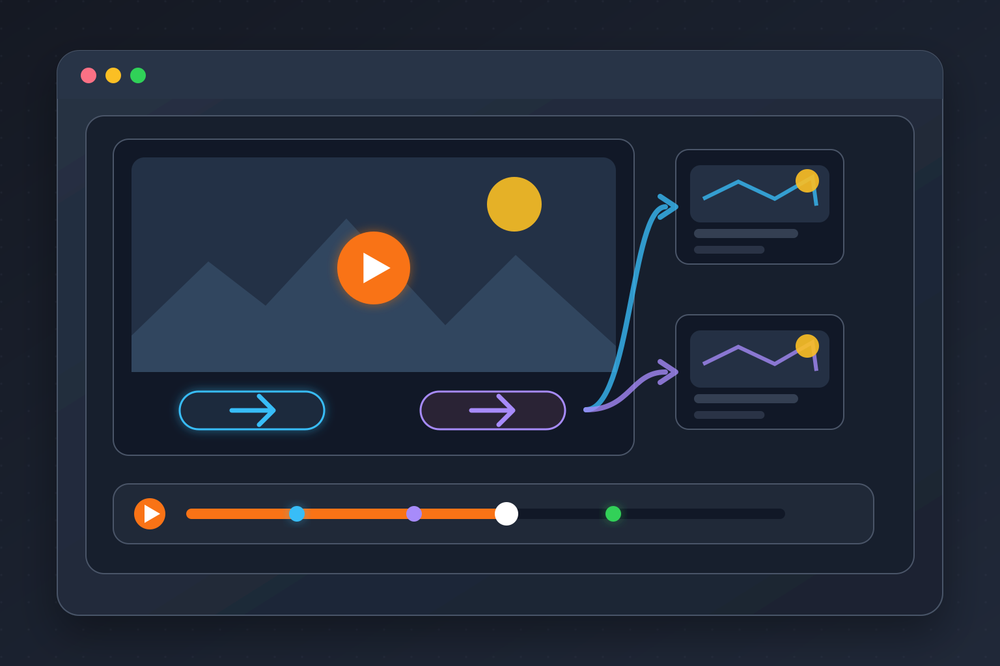
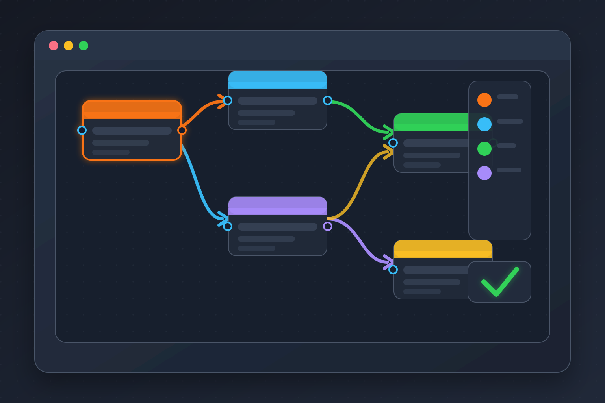
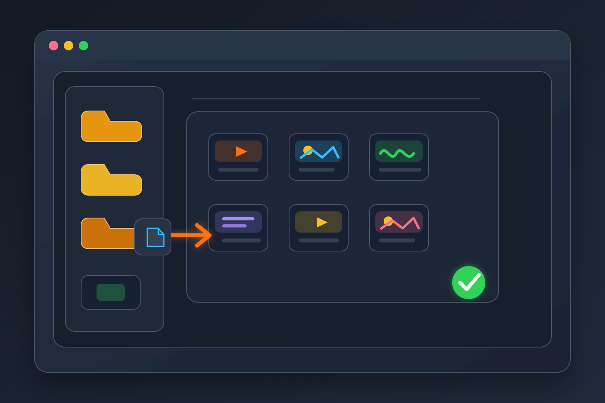
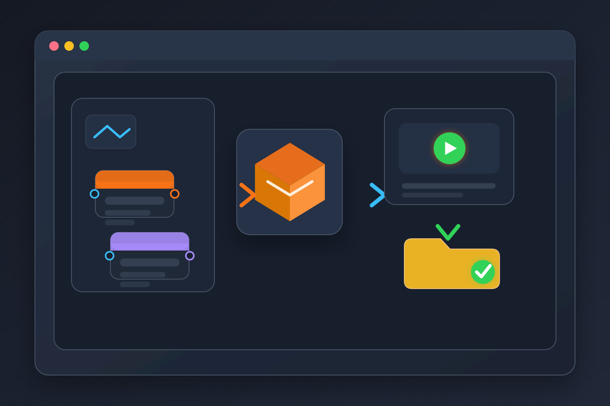
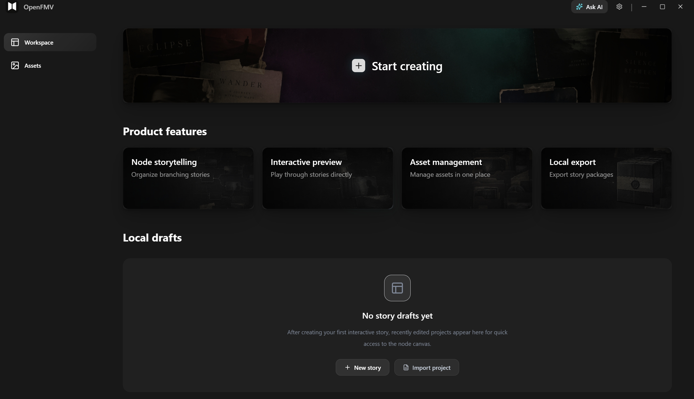
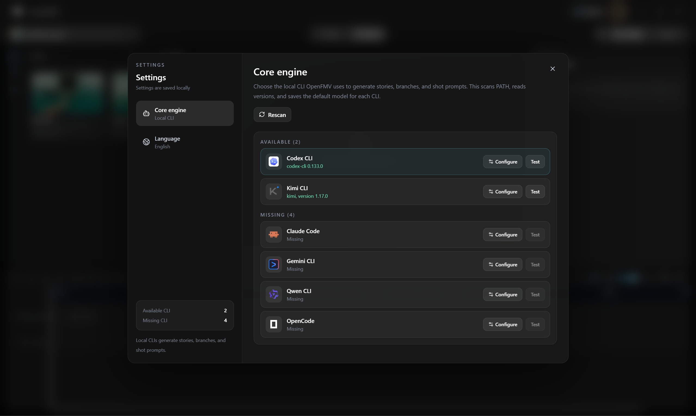
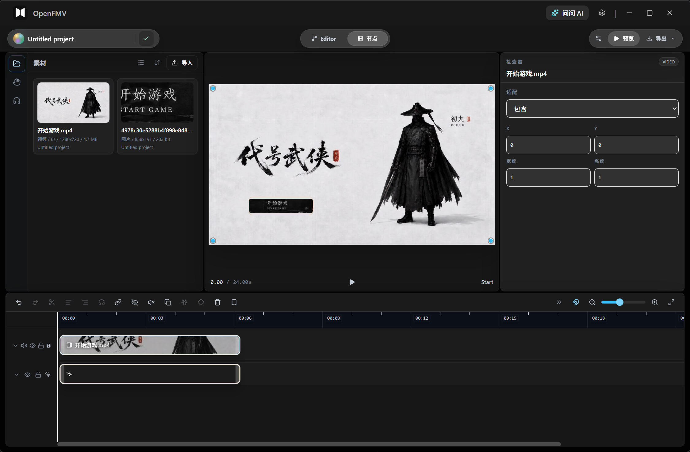

# OpenFMV

<p align="center">
  
</p>

<p align="center">
  <mark><strong>このプロジェクトは急速に進化しています。今後の更新にご期待ください。</strong></mark>
</p>

<p align="center">
  <a href="./readme.md">English</a> · <a href="./README.zh-CN.md">简体中文</a> · 日本語 · <a href="./README.ko.md">한국어</a>
</p>

OpenFMV は、インタラクティブ動画、分岐型ストーリー、インタラクティブ短編ドラマ、ローカルで再生できるストーリー体験を作成するための AI Native インタラクティブコンテンツエディターです。

中核になるのはノード単位の FlowTimeline です。各シーンにはメディアトラックに加えて、ボタン、ホットスポット、ポーズゲート、時間指定分岐、変数アクションのためのインタラクショントラックを持たせられます。ブループリントグラフは、それらのインタラクティブなシーンを接続する高レベルのマップとして機能します。ローカル素材、プレビュー、エクスポート、AI 支援制作は、ローカルファーストな Next.js + Electron デスクトップアプリの中に収まります。プロジェクト、インポートしたメディア、タイムラインデータ、生成パッケージはすべて手元のマシンに保存されます。アカウントシステム、ホスト型データベース、クラウドストレージには依存しません。


## プロダクトの特長

<table>
  <tr>
    <td width="25%" valign="top">
      
      <br />
      <strong>ノードのインタラクショントラック</strong><br />
      各シーンにメディア、ボタン、ホットスポット、ポーズゲート、分岐、変数アクションを重ねられます。
    </td>
    <td width="25%" valign="top">
      
      <br />
      <strong>ビジュアルストーリーマップ</strong><br />
      インタラクティブなシーンをブループリントで接続し、分岐、出力、ストーリーフローを整理できます。
    </td>
    <td width="25%" valign="top">
      
      <br />
      <strong>ローカル素材ライブラリ</strong><br />
      動画、画像、音声、テキスト素材をローカルプロジェクトフォルダーへ取り込めます。
    </td>
    <td width="25%" valign="top">
      
      <br />
      <strong>ローカルエクスポート</strong><br />
      メディア参照をローカルに保ったまま、再生可能なインタラクティブコンテンツをパッケージ化できます。
    </td>
  </tr>
</table>

## 作成できるもの

- インタラクティブ動画と分岐型ストーリープロトタイプ
- 選択肢によって再生が変化するインタラクティブ短編ドラマシーン
- デモ、レビュー、実験に使えるローカル再生可能なストーリーパッケージ
- プロジェクトデータをローカルに保つ AI 支援のナラティブ制作ワークフロー

## 制作ワークフロー

1. プロジェクトワークスペースからローカルプロジェクトを作成または開きます。
2. 元素材をローカル素材ライブラリにインポートします。
3. `/nodes` で FlowTimeline を使い、各シーンのメディアトラックとインタラクショントラックを編集します。
4. ボタン、ホットスポット、ポーズゲート、時間指定分岐、変数アクションをインタラクションクリップとして追加します。
5. ストーリーフローに分岐構造が必要になったら、`/editor` のブループリントグラフでシーンを接続します。
6. インタラクティブ再生をプレビューし、共有またはテストできる状態になったらローカル再生可能なパッケージを書き出します。

## プロダクトツアー

### インタラクティブ再生プレビュー

視聴者がストーリー内をどのように進むかをプレビューできます。ボタン選択、シーン遷移、インタラクティブ再生を文脈の中で確認する場所です。


### ローカルプロジェクトワークスペース

ローカルの下書き、プロジェクトテンプレート、最近の作業から開始できます。OpenFMV はホスト型ワークスペースではなく、ローカルプロジェクトファイルを中心に設計されています。



### ストーリーブループリントエディター

エディターは高レベルのストーリーマップです。ストーリーフロー、ノード関係、分岐出力、ノードプロンプト、シーンメタデータを扱います。


### AI Native 設定

OpenFMV はローカル AI 端末やモデルサービスと連携できるように設計されています。AI レイヤーは、プロジェクト保存をローカルに保ったまま、執筆、アイデア出し、編集ワークフローを支援することを目的としています。



### ビジュアルストーリープリセット

プリセットコンテンツは、インタラクティブストーリーの実験やビジュアル方向性を素早く始めるための出発点になります。



## コア機能

- **FlowTimeline シーン編集:** 各ノードを独立したタイムラインとして編集し、メディアトラックとインタラクショントラックを扱えます。
- **インタラクションクリップ:** タイムラインクリップとして、ボタン、ホットスポット、ポーズゲート、時間指定分岐、変数アクションを追加できます。
- **ブループリントグラフ編集:** ハンドル、エッジ、分岐出力でインタラクティブなノードを非線形ストーリーフローにつなげられます。
- **ローカルメディアワークフロー:** インポートしたファイルをローカルプロジェクトの素材フォルダーにコピーし、その参照をエクスポートまで保持します。
- **AI 支援制作:** ユーザーアカウントやクラウド同期を追加せずに、ローカル AI エンジンを設定してアシスタントワークフローを利用できます。
- **デスクトップファースト体験:** ローカル Next.js standalone サービスに支えられた Electron パッケージアプリとして実行できます。

## 現在の境界

OpenFMV は意図的にローカルファーストです。現在のプロダクトには、ログイン、複数ユーザー共同編集、クラウド同期、クラウドデータベース、ホスト型メディアライブラリ、第三者プラットフォームへのワンクリック公開は含まれていません。

AI 機能は支援用途です。脚本、絵コンテ、ビジュアル素材、インタラクションロジックをエンドツーエンドで完全自動生成する機能は、まだ提供していません。

エクスポートはローカル再生可能なパッケージとデスクトップアプリ配布ワークフローに重点を置いています。完全な Windows EXE ストーリーパッケージ化は現在のプロダクト範囲ではありません。

## 技術スタック

- **フレームワーク:** Next.js 16 App Router、React、TypeScript
- **デスクトップシェル:** Electron
- **グラフ編集:** React Flow
- **状態管理:** Zustand とローカルブラウザストレージ
- **スタイリング:** Tailwind CSS と `openfmv-*` デザイントークン
- **永続化:** ローカル OpenFMV プロジェクト JSON ファイルとコピーされたローカル素材
- **ランタイム:** プレビューとエクスポートで共有されるグラフランタイム

## クイックスタート

### 必要環境

- Node.js 20 以上
- npm
- 現在のデスクトップパッケージングは Windows を主な対象にしています

### インストール

```bash
npm install
```

### Web アプリを起動

```bash
npm run dev
```

その後、`http://localhost:3000` を開きます。

### デスクトップアプリを開発モードで起動

```bash
npm run desktop:dev
```

### Next.js アプリをビルド

```bash
npm run build
```

### デスクトップアプリをパッケージ化

```bash
npm run package:desktop
```

パッケージ化されたデスクトップアプリは、バックグラウンドでローカル Next.js standalone サービスを起動し、サービスの準備ができるとメイン画面を開きます。ローカルサービスに接続できない場合、OpenFMV はランタイムログのパスを含む診断エラーページを表示します。

## よく使うコマンド

```bash
npm run dev
npm run desktop
npm run desktop:dev
npm run desktop:standalone
npm run build
npm run package:desktop
npm run lint
npm run test:run
```

単一のテストファイルを実行:

```bash
npx vitest path/to/test.test.ts
```

単一のテスト名で実行:

```bash
npx vitest path/to/test.test.ts -t "test name"
```

## プロジェクト構成

```text
app/
  _components/          React コンポーネント
    editor/             ブループリントエディター UI
    local/              デスクトップ/ローカルプロジェクト UI
    nodes/              React Flow ノードコンポーネント
    player/             プレイヤーとプレビュー UI
    ui/                 共有 UI プリミティブ
  _features/
    node-timeline/      NodeTimeline v2 schema、UI、コマンド、スナップ、再生
  _hooks/               React hooks
  _store/               Zustand stores
  _types/               共有 TypeScript 型
  _utils/               ランタイムとグラフユーティリティ
  api/                  ローカル Next.js API routes
  editor/               ブループリントエディタールート
  nodes/                ノード単位タイムラインエディタールート
  play/[id]/            プレイヤールート
  projects/             プロジェクトワークスペースルート
electron/
  main.js               Electron メインプロセスとローカルサービス起動
  preload.js            Electron preload bridge
  exporter.js           ローカル再生可能パッケージエクスポーター
public/
  readme/               README スクリーンショット
shared/
  runtimeCore.mjs       プレイヤーとエクスポーターで共有されるランタイム
messages/
  *.json                next-intl ロケールファイル
__tests__/
  unit/                 Vitest ユニットテスト
```

## プロジェクトファイル

OpenFMV はプロジェクトをローカルプロジェクトファイルとコピー済みのローカル素材として保存します。インポートしたメディアはプロジェクト素材フォルダーに置き、従来のノード単位メディアフィールドではなく `node.data.timeline` から参照する必要があります。

ノードタイムラインモデルは、メディアとインタラクションの主要モデルです。

- メディアトラックには動画、画像、音声クリップが含まれます。
- インタラクショントラックにはボタン、ホットスポット、ポーズゲート、テキスト、分岐、変数クリップが含まれます。
- ランタイムプレビューとエクスポートはタイムラインモデルからコンパイルされます。

## エクスポートとパッケージング

OpenFMV のエクスポートは、タイムラインクリップのメディアパスをローカル再生可能パッケージ向けに書き換えます。タイムラインクリップの `src` と `poster` は、エクスポート時にコピーされて書き換えられます。

デスクトップパッケージングには Electron Builder を使用します。生成された実行ファイル、インストーラー、unpacked アプリフォルダーは `dist/` に書き出され、git では無視されます。

デスクトップアイコンはパッケージング前に `public/logo.png` から生成されます。

```text
build/icons/icon.ico
build/icons/icon.png
```

## 開発メモ

- タイムラインの挙動は `app/_features/node-timeline/` に保持します。
- 共有ランタイムの挙動は `shared/runtimeCore.mjs` に保持します。
- プレイヤー UI は `app/_components/player/` に保持します。
- ローカルデスクトップ UI は `app/_components/local/` に保持します。
- プロダクト範囲が明示的に変わらない限り、ホスト型バックエンド、ユーザーアカウント、クラウドストレージ、同期機能を追加しないでください。

## コントリビューション

OpenFMV はまだ急速に変化しています。変更は焦点を絞り、ローカルファーストで、タイムラインベースのアーキテクチャに沿ったものにしてください。

## 謝辞

OpenFMV は Next.js、Electron、React Flow、Zustand、Tailwind CSS、そして広範なオープンソース JavaScript エコシステムによって構築されています。

OpenFMV は、インスピレーションと参考を与えてくれた以下のオープンソースプロジェクトにも感謝します。

- [OpenCut-app/OpenCut](https://github.com/OpenCut-app/OpenCut)
- [nexu-io/open-design](https://github.com/nexu-io/open-design)

## ライセンス

MIT
