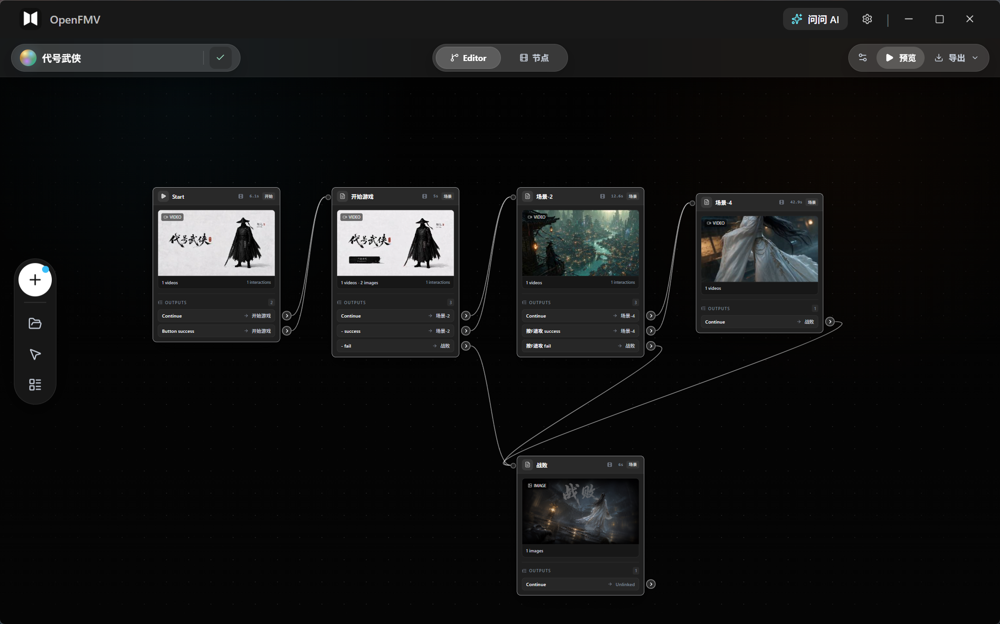
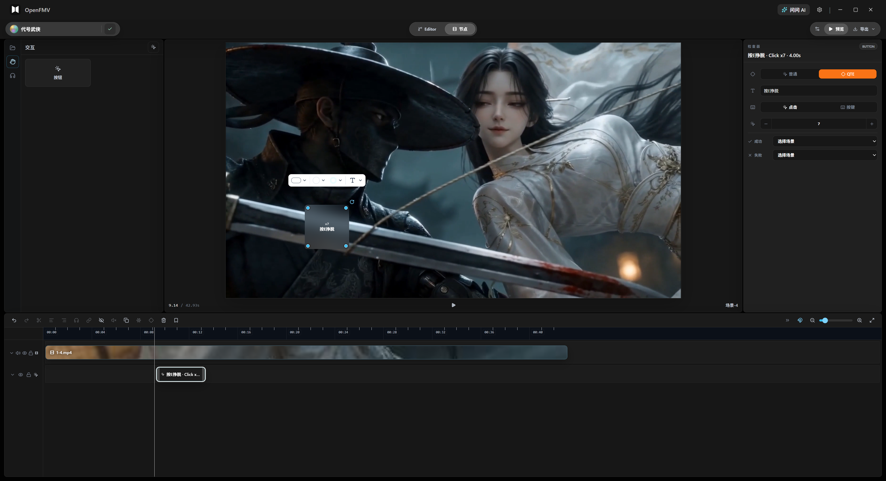

# OpenFMV

<p align="center">
  
</p>

<p align="center">
  <mark><strong>이 프로젝트는 빠르게 발전하고 있습니다. 앞으로의 업데이트를 기대해 주세요.</strong></mark>
</p>

<p align="center">
  <a href="./readme.md">English</a> · <a href="./README.zh-CN.md">简体中文</a> · <a href="./README.ja.md">日本語</a> · 한국어
</p>

OpenFMV는 인터랙티브 영상, 분기형 스토리, 인터랙티브 숏드라마, 독립 실행 가능한 데스크톱 스토리 경험을 만들기 위한 로컬 우선 비주얼 비선형 스토리텔링 에디터입니다.

현재 프로젝트는 Next.js 16 + Electron 데스크톱 앱입니다. React Flow를 사용해 스토리 그래프 편집 캔버스를 구성합니다. 프로젝트 파일, 가져온 에셋, 내보낸 콘텐츠는 모두 로컬에 저장되며, 계정 시스템, 데이터베이스, 클라우드 스토리지에 의존하지 않습니다.



## 기능

- 비주얼 스토리 그래프: 시작, 스토리, 인터랙션, 엔딩 노드로 비선형 서사를 구성합니다.
- 분기 인터랙션: 선택지, 텍스트 입력, 슬라이드 잠금 해제, 카운트다운, 기본 경로를 지원합니다.
- 로컬 에셋 관리: 이미지, 비디오, 오디오, 텍스트 에셋을 가져오고 로컬 프로젝트와 함께 저장합니다.
- 즉시 재생 미리보기: 편집 후 플레이어 뷰에서 분기 경험을 바로 확인합니다.
- 프로젝트 가져오기 및 내보내기: OpenFMV JSON 파일로 프로젝트를 저장해 백업, 이동, 버전 관리에 활용할 수 있습니다.
- 데스크톱 게임 내보내기: 프로젝트를 실행 가능한 Electron 데스크톱 경험으로 패키징할 수 있습니다.
- 로컬 AI 지원: 데스크톱 앱에서 로컬 CLI Agent 또는 자체 키로 설정한 모델 서비스를 호출할 수 있습니다.

## 화면 미리보기

### 분기 재생 미리보기



### 로컬 프로젝트 작업 공간


## 기술 스택

- Next.js 16 App Router
- TypeScript
- React 19
- React Flow
- Zustand
- Tailwind CSS
- Electron
- Vitest

## 빠른 시작

### 요구 사항

- Node.js 20 이상
- npm
- 데스크톱 환경은 Windows를 우선 지원합니다. Web 개발 모드는 다른 시스템에서도 실행할 수 있습니다.

### 의존성 설치

```bash
npm install
```

### Web 개발 서버 시작

```bash
npm run dev
```

기본 접속 주소:

```text
http://localhost:3000
```

### 데스크톱 앱 시작

```bash
npm run desktop:dev
```

빌드된 standalone 버전을 사용하려면:

```bash
npm run build
npm run desktop:standalone
```

## 자주 사용하는 명령

```bash
npm run dev                 # Next.js 개발 서버 시작
npm run desktop             # Electron 데스크톱 앱 시작
npm run desktop:dev         # 데스크톱 개발 모드 시작
npm run desktop:standalone  # standalone 데스크톱 모드 시작
npm run build               # 앱 빌드
npm run package:desktop     # 데스크톱 앱 패키징
npm run lint                # lint 실행
npm run test:run            # 테스트 실행
```

단일 테스트 파일 실행:

```bash
npx vitest path/to/test.test.ts
```

단일 테스트 케이스 실행:

```bash
npx vitest path/to/test.test.ts -t "test name"
```

## 프로젝트 구조

```text
app/
  _components/          React 컴포넌트
    nodes/              React Flow 노드 컴포넌트
    editor/             에디터 UI
    player/             플레이어 컴포넌트
    local/              로컬 데스크톱 UI
    ui/                 공용 UI 컴포넌트
  _hooks/               React hooks
  _store/               Zustand stores
  _types/               공유 TypeScript 타입
  _utils/               유틸리티 함수
  api/                  로컬 Next.js API routes
  editor/               에디터 페이지
  play/[id]/            재생 페이지
  projects/             프로젝트 관리 페이지
  asset-studio/         에셋 스튜디오
  assets/               에셋 페이지
electron/
  main.js               Electron 메인 프로세스 및 IPC
  preload.js            preload API
  exporter.js           데스크톱 경험 내보내기 도구
scripts/                빌드 및 패키징 스크립트
__tests__/              테스트
```

## 프로젝트 파일

OpenFMV 프로젝트는 JSON 형식으로 저장됩니다. 핵심 필드는 다음과 같습니다.

```text
schemaVersion
id
title
graphData
assets
metadata
createdAt
updatedAt
```

가져온 에셋은 로컬 프로젝트 또는 앱 데이터 디렉터리에 복사됩니다. 프로젝트나 데스크톱 경험을 내보낼 때 관련 에셋도 출력 디렉터리에 함께 복사되어, 결과물이 원본 에셋 경로에 의존하지 않고 실행될 수 있도록 합니다.

## 데스크톱 내보내기

사용:

```bash
npm run package:desktop
```

빌드가 완료되면 데스크톱 앱은 `dist/`에 출력됩니다. 앱 안에서 내보낸 인터랙티브 스토리에는 런타임, 프로젝트 그래프 데이터, 에셋 리소스가 포함되므로 플레이어 또는 테스터에게 배포하기에 적합합니다.

## 개발 참고

- 이 프로젝트는 로컬 우선 설계를 따르며 로그인, 사용자 동기화, 호스팅 백엔드, 데이터베이스, 클라우드 스토리지를 포함하지 않습니다.
- 공유 타입 정의는 `app/_types/index.ts`에 있습니다.
- 새 노드 타입을 추가할 때는 타입, 노드 등록, 에디터 컴포넌트, 플레이어 로직, 내보내기 런타임을 함께 업데이트해야 합니다.
- 스타일은 Tailwind CSS를 사용하며, 커스텀 색상은 `app/globals.css`에 모여 있습니다.
- React Flow 노드 컴포넌트는 `React.memo`로 감싸야 합니다.

자세한 아키텍처 규칙은 `docs/architecture-boundaries.md`와 `docs/editor-connection-rules.md`를 참고하세요.

## 기여

Issue와 pull request를 환영합니다. 제출 전에 다음 명령을 실행하는 것을 권장합니다.

```bash
npm run lint
npm run test:run
```

변경 사항이 데스크톱 내보내기 또는 재생 흐름에 영향을 준다면, 편집, 저장, 미리보기, 내보내기 경로도 수동으로 확인하세요.

## 감사

오픈 영상 편집 워크플로와 인터랙션 디자인에 참고가 된 [OpenCut](https://github.com/OpenCut-app/OpenCut)에 감사드립니다.

## 라이선스

이 프로젝트는 MIT License로 오픈소스 공개되어 있습니다. 상업적 이용을 포함해 이 프로젝트의 사본을 자유롭게 사용, 복사, 수정, 병합, 게시, 배포, 재라이선스, 판매할 수 있습니다. 단, 모든 사본 또는 주요 부분에 원래의 저작권 고지와 라이선스 본문을 유지해야 합니다.
