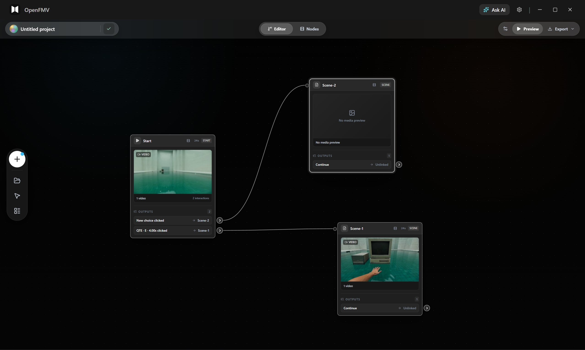
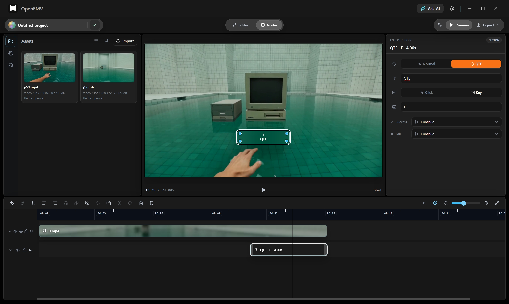

# OpenFMV

<p align="center">
  
</p>

<p align="center">
  <mark><strong>该项目正在快速迭代，敬请期待。</strong></mark>
</p>

<p align="center">
  <a href="./readme.md">English</a> · 简体中文 · <a href="./README.ja.md">日本語</a> · <a href="./README.ko.md">한국어</a>
</p>

OpenFMV 是一个 AI Native 互动内容编辑器，用于制作互动视频、分支叙事、互动短剧，以及可在本地播放的故事体验。

它在一个本地优先的 Next.js + Electron 桌面应用中，结合了可视化故事蓝图、节点级 FlowTimeline 编辑器、本地素材管理、互动预览、导出工具和 AI 辅助创作层。项目、导入媒体、时间线数据和生成包都会保存在你的设备上，不依赖账号系统、托管数据库或云端存储。



## 产品亮点

<table>
  <tr>
    <td width="25%" valign="top">
      
      <br />
      <strong>可视化故事蓝图</strong><br />
      用节点、分支、出口和清晰的场景关系设计非线性故事结构。
    </td>
    <td width="25%" valign="top">
      
      <br />
      <strong>互动预览</strong><br />
      在导出前测试场景播放、时间点、按钮选择和分支行为。
    </td>
    <td width="25%" valign="top">
      
      <br />
      <strong>本地素材库</strong><br />
      将视频、图片、音频和文本素材导入本地项目文件夹。
    </td>
    <td width="25%" valign="top">
      
      <br />
      <strong>本地导出</strong><br />
      打包可播放的互动内容，同时保持媒体引用本地化。
    </td>
  </tr>
</table>

## 适合制作什么

- 互动视频和分支叙事原型
- 基于选择驱动播放的互动短剧场景
- 用于演示、评审和实验的本地可播放故事包
- 仍然保持项目数据本地化的 AI 辅助叙事工作流

## 创作流程

1. 在项目工作区创建或打开本地项目。
2. 将源素材导入本地素材库。
3. 在 `/editor` 故事蓝图中搭建故事结构。
4. 在 `/nodes` 中使用 FlowTimeline 编辑每个场景的媒体轨和交互轨。
5. 预览互动播放和分支行为。
6. 当故事准备好分享或测试时，导出本地可播放包。

## 产品预览

### 本地项目工作区

从本地草稿、项目模板和最近项目开始。OpenFMV 围绕本地项目文件设计，而不是托管工作区。


### 故事蓝图编辑器

编辑器是高层级故事地图，负责故事流、节点关系、分支出口、节点提示词和场景元数据。


### 互动播放预览

预览观众如何在故事中前进。这里可以在上下文中检查按钮选择、场景跳转和互动播放。



### AI Native 配置

OpenFMV 被设计为可连接本地 AI 终端和模型服务。AI 层用于辅助写作、构思和编辑，同时让项目存储保持在本地。


### 视觉故事预设

预设内容可以为互动故事实验和视觉方向提供一个快速起点。


## 核心能力

- **蓝图图编辑：** 使用节点、句柄、连线和分支出口构建非线性故事流。
- **FlowTimeline 场景编辑：** 将每个节点作为独立时间线编辑，包含媒体轨和交互轨。
- **交互片段：** 通过时间线片段添加按钮、热点、暂停门、定时分支和变量动作。
- **本地媒体工作流：** 将导入文件复制到本地项目素材文件夹，并在导出中保留这些引用。
- **AI 辅助创作：** 配置本地 AI 引擎并使用助手工作流，不引入用户账号或云同步。
- **桌面优先体验：** 作为 Electron 打包应用运行，背后由本地 Next.js standalone 服务提供界面。

## 当前边界

OpenFMV 有意保持本地优先。当前产品不包含登录、多用户协作、云同步、云数据库、托管媒体库或一键发布到第三方平台。

AI 功能是辅助型能力。项目目前还不提供脚本、分镜、视觉素材和交互逻辑的全流程自动生成。

导出重点是本地可播放包和桌面应用分发工作流。完整的 Windows EXE 故事打包不属于当前产品范围。

## 技术栈

- **框架：** Next.js 16 App Router、React、TypeScript
- **桌面外壳：** Electron
- **图编辑：** React Flow
- **状态管理：** Zustand 和本地浏览器存储
- **样式：** Tailwind CSS 与 `openfmv-*` 设计 token
- **持久化：** 本地 OpenFMV 项目 JSON 文件和复制后的本地素材
- **运行时：** 预览和导出共用的共享图运行时

## 快速开始

### 环境要求

- Node.js 20 或更高版本
- npm
- Windows 是当前优先支持的桌面打包目标

### 安装依赖

```bash
npm install
```

### 启动 Web 应用

```bash
npm run dev
```

然后打开 `http://localhost:3000`。

### 启动桌面开发模式

```bash
npm run desktop:dev
```

### 构建 Next.js 应用

```bash
npm run build
```

### 打包桌面应用

```bash
npm run package:desktop
```

打包后的桌面应用会在后台启动本地 Next.js standalone 服务，并在服务就绪后打开主界面。如果本地服务无法访问，OpenFMV 会显示带有运行日志路径的诊断错误页。

## 常用命令

```bash
npm run dev
npm run desktop
npm run desktop:dev
npm run desktop:standalone
npm run build
npm run package:desktop
npm run lint
npm run test:run
```

运行单个测试文件：

```bash
npx vitest path/to/test.test.ts
```

运行单个测试用例：

```bash
npx vitest path/to/test.test.ts -t "test name"
```

## 项目结构

```text
app/
  _components/          React 组件
    editor/             蓝图编辑器 UI
    local/              桌面端/本地项目 UI
    nodes/              React Flow 节点组件
    player/             播放器和预览 UI
    ui/                 共享 UI 基础组件
  _features/
    node-timeline/      NodeTimeline v2 schema、UI、命令、吸附、播放
  _hooks/               React hooks
  _store/               Zustand stores
  _types/               共享 TypeScript 类型
  _utils/               运行时和图工具
  api/                  本地 Next.js API routes
  editor/               蓝图编辑器路由
  nodes/                节点级时间线编辑器路由
  play/[id]/            播放器路由
  projects/             项目工作区路由
electron/
  main.js               Electron 主进程和本地服务启动逻辑
  preload.js            Electron preload bridge
  exporter.js           本地可播放包导出器
public/
  readme/               README 截图
shared/
  runtimeCore.mjs       播放器和导出器共用运行时
messages/
  *.json                next-intl 语言文件
__tests__/
  unit/                 Vitest 单元测试
```

## 项目文件

OpenFMV 将项目保存为本地项目文件和复制后的本地素材。导入媒体应存放在项目素材文件夹中，并通过 `node.data.timeline` 引用，而不是旧的节点级媒体字段。

节点时间线模型是主要的媒体与交互模型：

- 媒体轨包含视频、图片和音频片段。
- 交互轨包含按钮、热点、暂停门、文本、分支和变量片段。
- 运行时预览和导出都会从时间线模型编译。

## 导出与打包

OpenFMV 导出会将时间线片段中的媒体路径重写到本地可播放包中。时间线片段的 `src` 和 `poster` 会在导出时复制并重写。

桌面打包使用 Electron Builder。生成的可执行文件、安装包和 unpacked 应用目录会写入 `dist/`，并被 git 忽略。

桌面图标会在打包前从 `public/logo.png` 生成：

```text
build/icons/icon.ico
build/icons/icon.png
```

## 开发说明

- 时间线行为保持在 `app/_features/node-timeline/`。
- 共享运行时行为保持在 `shared/runtimeCore.mjs`。
- 播放器 UI 保持在 `app/_components/player/`。
- 本地桌面 UI 保持在 `app/_components/local/`。
- 除非产品范围被明确改变，不要添加托管后端、用户账号、云存储或同步功能。

## 贡献

OpenFMV 仍在快速迭代。请保持改动聚焦、本地优先，并与基于时间线的架构保持一致。

## 致谢

OpenFMV 基于 Next.js、Electron、React Flow、Zustand、Tailwind CSS 以及更广泛的开源 JavaScript 生态构建。

## 许可证

MIT
